# Lab 4 - Neo4j

**Course:** Data Storage and Management Technologies (GIK2NV)  
**Date:** 2023-10-10  
**Repo:** [https://github.com/sebdanielsson/gik2nv-lab4-neo4j](https://github.com/sebdanielsson/gik2nv-lab4-neo4j)

**Authors:**  
Sebastian Danielsson (h21sebda)  
Veronika Engberg (h21veren)  
Jesper Andersson (h21jespa)

## Table of Contents

- [Lab 4 - Neo4j](#lab-4---neo4j)
  - [Table of Contents](#table-of-contents)
  - [A. Description](#a-description)
  - [B. Nodes and Relationships](#b-nodes-and-relationships)
  - [C. Questions](#c-questions)
  - [D. Model](#d-model)
  - [E. Implementation](#e-implementation)
    - [Code for creating the graph](#code-for-creating-the-graph)
    - [Code for querying the graph](#code-for-querying-the-graph)
    - [General queries](#general-queries)

## A. Description

This project will build a simple book recommendation model with Neo4j. The graph will contain books, authors, users, and genres. The graph will be queried to find book recommendations for a user. The recommendations will be based on the books that the user has previously read in terms of genre and author, as well as their friends' previously read books and the ratings they gave them.

A graph database is a good choice for this project because it is easy to represent the relationships between books, authors, users, and genres. The graph database will also be able to quickly find the shortest path between two users, which will be useful for finding the books that a user's friends have read.

## B. Nodes and Relationships

The graph will contain four nodes. These nodes were chosen because they are distinct entities with unique properties that will be used in the relationships.

The first label is **_Book_**, representing nodes containing information about individual books. Nodes with this label will have properties such as `bookID`, `title`, and `publicationYear`.  
The second label is **_Genre_**, representing nodes containing information about a specific genre. Nodes with this label will have properties such as `genreID`, and `genreName`.  
The third label is **_Author_**, representing nodes containing information about a specific author. Nodes with this label will have properties such as `authorID`, `name`, and `gender`.  
The fourth label is **_User_**, representing nodes containing infornation about specific a specific user. Nodes with this label will have properties such as `userID`, `name`, `birthYear`, and `gender`.

- **Label:** Book  
  **Properties:** bookID, title, publicationYear

- **Label:** Genre  
  **Properties:** genreID, genreName

- **Label:** Author  
  **Properties:** authorID, name, gender

- **Label:** User  
  **Properties:** userID, name, birthYear, gender

---

The graph will contain five relationships. These relationships were chosen because they are the relationships that exist between the nodes.

The first relationship is **_READ_**, representing the relationship between a user and a book that the user has read. This relationship will have properties such as `rating` and `dateRead`.  
The second relationship is **_FRIENDS_WITH_**, representing the relationship between two users that are friends. This relationship will not have any properties.  
The third relationship is **_WRITTEN_BY_**, representing the relationship between a book and an author that wrote the book. This relationship will not have any properties.  
The fourth relationship is **_BELONGS_TO_**, representing the relationship between a book and a genre that the book belongs to. This relationship will not have any properties.

- **Type:** READ  
  **Entities:** User - Book  
  **Properties:** rating, dateRead

- **Type:** FRIENDS_WITH  
  **Entities:** User - User  
  **Properties:** (none)

- **Type:** WRITTEN_BY  
  **Entities:** Book - Author  
  **Properties:** (none)

- **Type:** BELONGS_TO  
  **Entities:** Book - Genre  
  **Properties:** (none)

## C. Questions

The graph should be able to be able to provide basic stats for a fictional book reading community, as well as offer book recommendations for users. The recommendations will be based on the books that the user has previously read in terms of genre and author. The recommendation engine should also be able to provide recommendations based on friends' previously read books, the ratings they gave them and how many friends have read the book.

The number of questions that _can_ be answered by just these four nodes and five relationships is _huge_, so we will list some questions that come to mind and pick a few to answer in the queries.

1. Which books have been read by a particular user? (Ordered by most recently read)
2. Which books have been written by a particular author? (Could be sorted by publication year, rating, number of readers)
3. Which books are trending among men and women respectively? (Could be for a certain time period)
4. Which books are popular among men and women respectively? (Could be for a certain time period)
5. Which books are trending in a particular genre? (Could be for a certain time period)
6. Which books are popular in a particular genre? (Could be for a certain time period)
7. Which books are trending in the users age group? (Could be for a certain time period)
8. Which books are popular in the users age group? (Could be for a certain time period)
9. Which books are trending among a user's friends? (Number of friends that have read the book. Could be for a certain time period)
10. Which books are popular among a user's friends? (Highest mean rating among friends. Could be for a certain time period)

If we can answer these questions, we can also answer much harder questions such as: "Which books will the user most likely want to read next?". By weighting the results of the previous questions we can find the books that are most likely to be liked by the user. The weighting could be based on the user's previous ratings for books in a certain genre or the number of read books written by a particular author, the number of friends that have read the book, the mean rating among friends, etc. Finding the optimal weighting for the different factors is outside the scope of this project, but it is possible to implement a simple recommendation engine based on the graph.

For this project we will try to answer questions 1-10.

## D. Model

Mermaid diagram of the model:

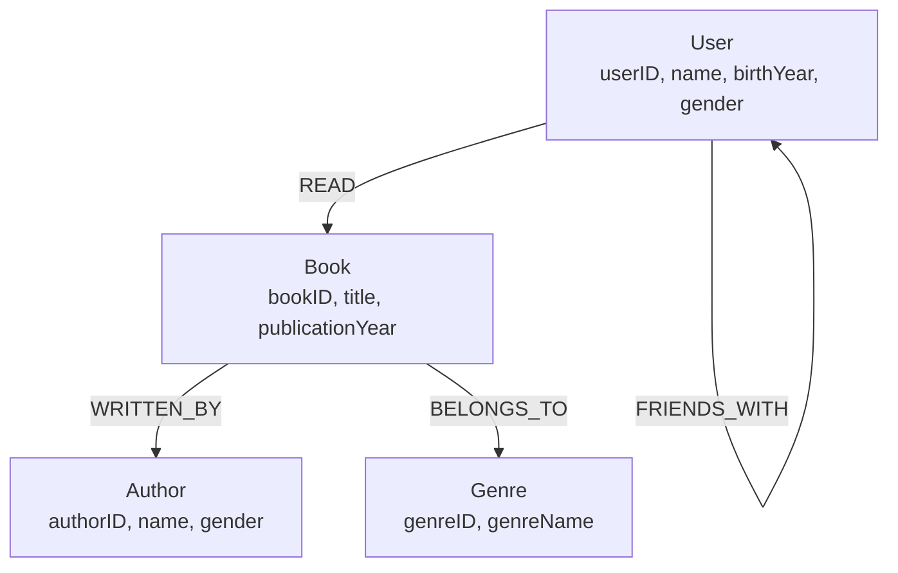

## E. Implementation

We couldn't get the [Neo4j Sandbox](https://neo4j.com/sandbox/) to work so we used the offial Docker image instead. The Docker image is available at [https://hub.docker.com/\_/neo4j](https://hub.docker.com/_/neo4j).

### Code for creating the graph

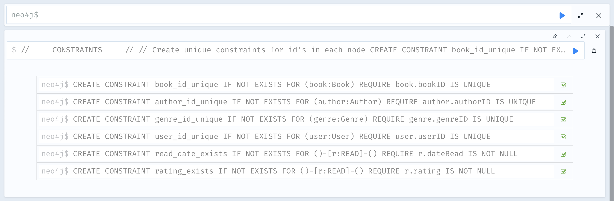

```cypher
// --- CONSTRAINTS --- //

// Create unique constraints for id's in each node
CREATE CONSTRAINT book_id_unique IF NOT EXISTS
FOR (book:Book) REQUIRE book.bookID IS UNIQUE;

CREATE CONSTRAINT author_id_unique IF NOT EXISTS
FOR (author:Author) REQUIRE author.authorID IS UNIQUE;

CREATE CONSTRAINT genre_id_unique IF NOT EXISTS
FOR (genre:Genre) REQUIRE genre.genreID IS UNIQUE;

CREATE CONSTRAINT user_id_unique IF NOT EXISTS
FOR (user:User) REQUIRE user.userID IS UNIQUE;

// Require a rating and date for finish reading the book. (Requires enterprise edition)
CREATE CONSTRAINT read_date_exists IF NOT EXISTS
FOR ()-[r:READ]-()
REQUIRE r.dateRead IS NOT NULL;

CREATE CONSTRAINT rating_exists IF NOT EXISTS
FOR ()-[r:READ]-()
REQUIRE r.rating IS NOT NULL;
```

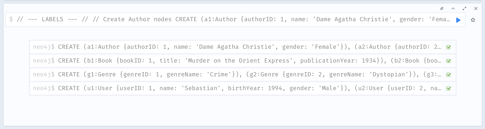


```cypher
// --- LABELS --- //

// Create Author nodes
CREATE
       (a1:Author {authorID: 1, name: 'Dame Agatha Christie', gender: 'Female'}),
       (a2:Author {authorID: 2, name: 'George Orwell', gender: 'Male'}),
       (a3:Author {authorID: 3, name: 'J. K. Rowling', gender: 'Female'}),
       (a4:Author {authorID: 4, name: 'F. Scott Fitzgerald', gender: 'Male'});

// Create Book nodes
CREATE
       (b1:Book {bookID: 1, title: 'Murder on the Orient Express', publicationYear: 1934}),
       (b2:Book {bookID: 2, title: '1984', publicationYear: 1949}),
       (b3:Book {bookID: 3, title: 'The Great Gatsby', publicationYear: 1925}),
       (b4:Book {bookID: 4, title: 'Harry Potter and the Philosopher\'s Stone', publicationYear: 1997});

// Create Genre nodes
CREATE
       (g1:Genre {genreID: 1, genreName: 'Crime'}),
       (g2:Genre {genreID: 2, genreName: 'Dystopian'}),
       (g3:Genre {genreID: 3, genreName: 'Fantasy'}),
       (g4:Genre {genreID: 4, genreName: 'Tragedy'});

// Create User nodes
CREATE (u1:User {userID: 1, name: 'Sebastian', birthYear: 1994, gender: 'Male'}),
       (u2:User {userID: 2, name: 'Veronika', birthYear: 1987, gender: 'Female'}),
       (u3:User {userID: 3, name: 'Jesper', birthYear: 1990, gender: 'Male'}),
       (u4:User {userID: 4, name: 'Elon', birthYear: 1971, gender: 'Male'});
```

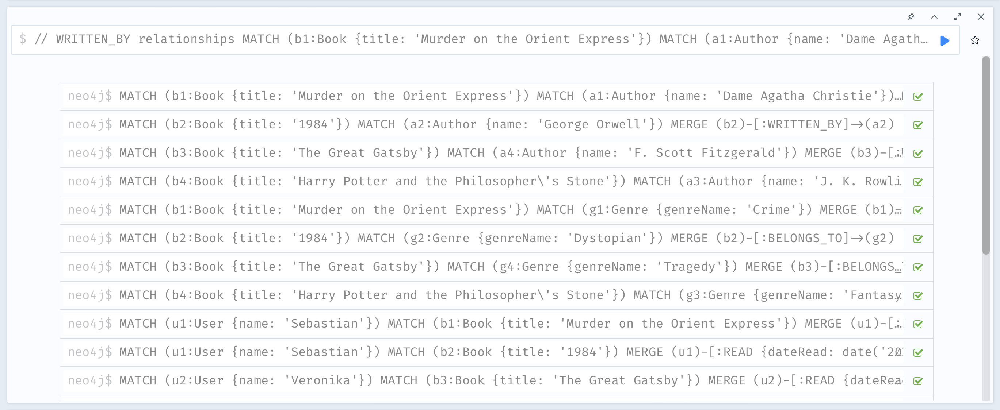
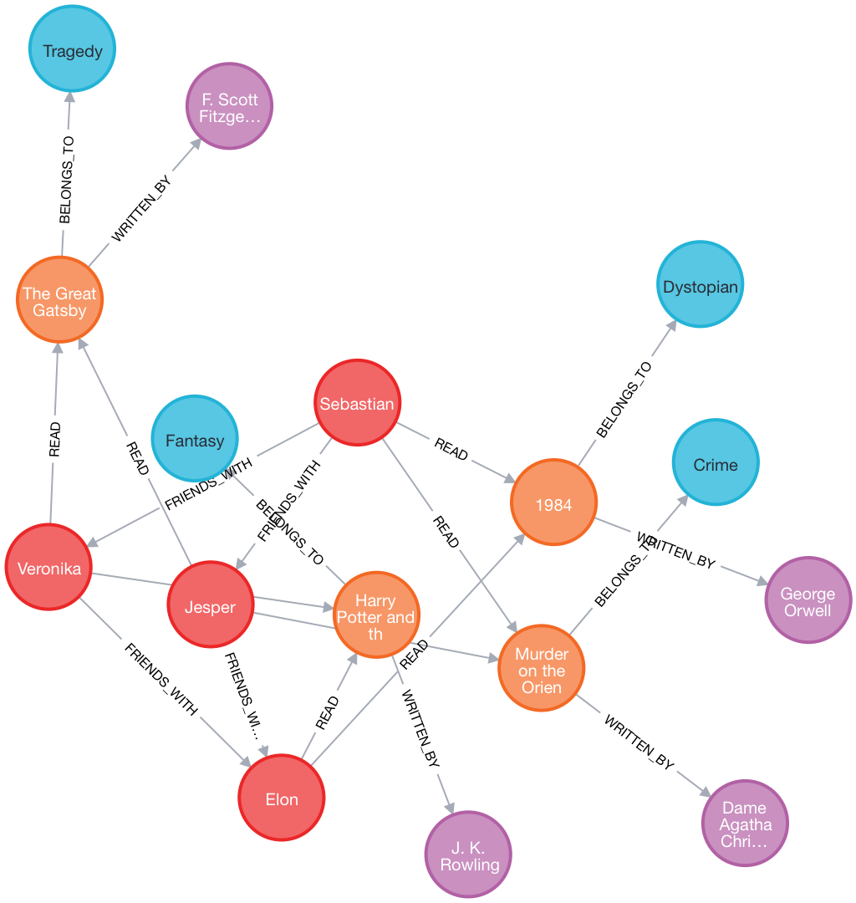

```cypher
// --- RELATIONSHIPS --- //

// WRITTEN_BY relationships
MATCH (b1:Book {title: 'Murder on the Orient Express'})
MATCH (a1:Author {name: 'Dame Agatha Christie'})
MERGE (b1)-[:WRITTEN_BY]->(a1);

MATCH (b2:Book {title: '1984'})
MATCH (a2:Author {name: 'George Orwell'})
MERGE (b2)-[:WRITTEN_BY]->(a2);

MATCH (b3:Book {title: 'The Great Gatsby'})
MATCH (a4:Author {name: 'F. Scott Fitzgerald'})
MERGE (b3)-[:WRITTEN_BY]->(a4);

MATCH (b4:Book {title: 'Harry Potter and the Philosopher\'s Stone'})
MATCH (a3:Author {name: 'J. K. Rowling'})
MERGE (b4)-[:WRITTEN_BY]->(a3);

// BELONGS_TO relationships
MATCH (b1:Book {title: 'Murder on the Orient Express'})
MATCH (g1:Genre {genreName: 'Crime'})
MERGE (b1)-[:BELONGS_TO]->(g1);

MATCH (b2:Book {title: '1984'})
MATCH (g2:Genre {genreName: 'Dystopian'})
MERGE (b2)-[:BELONGS_TO]->(g2);

MATCH (b3:Book {title: 'The Great Gatsby'})
MATCH (g4:Genre {genreName: 'Tragedy'})
MERGE (b3)-[:BELONGS_TO]->(g4);

MATCH (b4:Book {title: 'Harry Potter and the Philosopher\'s Stone'})
MATCH (g3:Genre {genreName: 'Fantasy'})
MERGE (b4)-[:BELONGS_TO]->(g3);

// READ relationships
MATCH (u1:User {name: 'Sebastian'})
MATCH (b1:Book {title: 'Murder on the Orient Express'})
MERGE (u1)-[:READ {dateRead: date('2023-03-10'), rating: 2}]->(b1);

MATCH (u1:User {name: 'Sebastian'})
MATCH (b2:Book {title: '1984'})
MERGE (u1)-[:READ {dateRead: date('2023-08-01'), rating: 5}]->(b2);

MATCH (u2:User {name: 'Veronika'})
MATCH (b3:Book {title: 'The Great Gatsby'})
MERGE (u2)-[:READ {dateRead: date('2023-07-10'), rating: 3}]->(b3);

MATCH (u2:User {name: 'Veronika'})
MATCH (b4:Book {title: 'Harry Potter and the Philosopher\'s Stone'})
MERGE (u2)-[:READ {dateRead: date('2023-05-23'), rating: 1}]->(b4);

MATCH (u3:User {name: 'Jesper'})
MATCH (b1:Book {title: 'Murder on the Orient Express'})
MERGE (u3)-[:READ {dateRead: date('2023-12-20'), rating: 5}]->(b1);

MATCH (u3:User {name: 'Jesper'})
MATCH (b3:Book {title: 'The Great Gatsby'})
MERGE (u3)-[:READ {dateRead: date('2023-09-14'), rating: 4}]->(b3);

MATCH (u4:User {name: 'Elon'})
MATCH (b2:Book {title: '1984'})
MERGE (u4)-[:READ {dateRead: date('2023-01-29'), rating: 5}]->(b2);

MATCH (u4:User {name: 'Elon'})
MATCH (b4:Book {title: 'Harry Potter and the Philosopher\'s Stone'})
MERGE (u4)-[:READ {dateRead: date('2023-10-10'), rating: 4}]->(b4);

// FRIENDS_WITH relationships
MATCH (u1:User {name: 'Sebastian'})
MATCH (u2:User {name: 'Veronika'})
MERGE (u1)-[:FRIENDS_WITH]->(u2);

MATCH (u1:User {name: 'Sebastian'})
MATCH (u3:User {name: 'Jesper'})
MERGE (u1)-[:FRIENDS_WITH]->(u3);

MATCH (u2:User {name: 'Veronika'})
MATCH (u4:User {name: 'Elon'})
MERGE (u2)-[:FRIENDS_WITH]->(u4);

MATCH (u3:User {name: 'Jesper'})
MATCH (u4:User {name: 'Elon'})
MERGE (u3)-[:FRIENDS_WITH]->(u4);
```

### Code for querying the graph

```cypher
// Q1: Books read by Sebastian
MATCH (u:User)-[r:READ]->(b:Book)
WHERE u.name = 'Sebastian'
RETURN b.title, r.dateRead, r.rating
ORDER BY r.dateRead DESC;
```

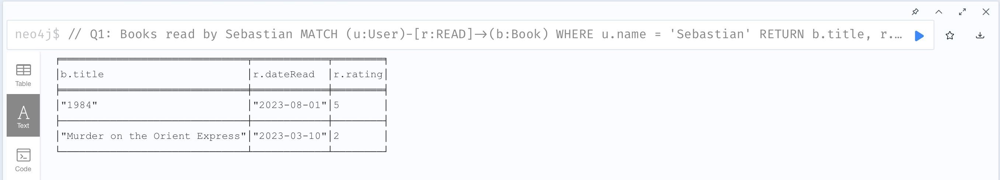

```cypher
// Q2: Books written by Dame Agatha Christie
MATCH (b:Book)-[:WRITTEN_BY]->(a:Author)
WHERE a.name = 'Dame Agatha Christie'
OPTIONAL MATCH (b)<-[r:READ]-()
RETURN b.title, b.publicationYear, AVG(r.rating) AS meanRating, COUNT(r) AS readers
ORDER BY b.publicationYear;
```

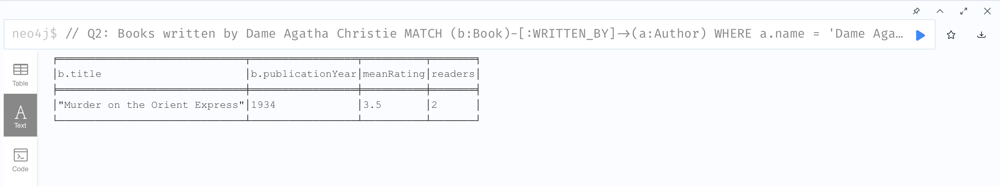

```cypher
// Q3A: Top 10 trending books with males last month
WITH date() - duration('P1M') AS lastMonthDate

MATCH (b:Book)<-[r:READ]-(u:User)
WHERE u.gender = 'Male' AND r.dateRead >= lastMonthDate
RETURN b.title, COUNT(r) AS maleReaders
ORDER BY maleReaders DESC
LIMIT 10;
```

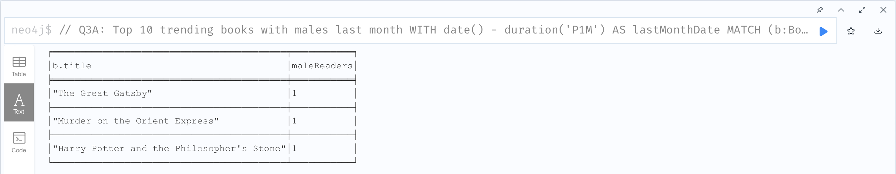

```cypher
// Q3B: Top 10 trending books with females last month
WITH date() - duration('P1M') AS lastMonthDate

MATCH (b:Book)<-[r:READ]-(u:User)
WHERE u.gender = 'Female' AND r.dateRead >= lastMonthDate
RETURN b.title, COUNT(r) AS femaleReaders
ORDER BY femaleReaders DESC
LIMIT 10;
```

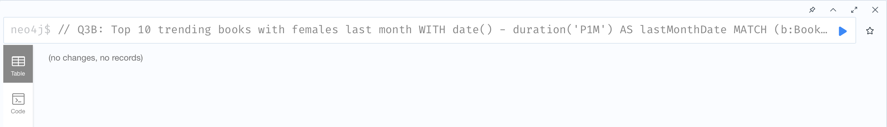

```cypher
// Q4A: Top 10 top-rated books by males from the last month
WITH date() - duration('P1M') AS lastMonthDate

MATCH (b:Book)<-[r:READ]-(u:User)
WHERE u.gender = 'Male' AND r.dateRead >= lastMonthDate
RETURN b.title, AVG(r.rating) AS avgMaleRating
ORDER BY avgMaleRating DESC
LIMIT 10;
```

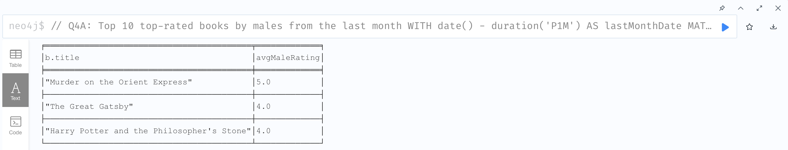

```cypher
// Q4B: Top 10 top-rated books by females from the last month
WITH date() - duration('P1M') AS lastMonthDate

MATCH (b:Book)<-[r:READ]-(u:User)
WHERE u.gender = 'Female' AND r.dateRead >= lastMonthDate
RETURN b.title, AVG(r.rating) AS avgFemaleRating
ORDER BY avgFemaleRating DESC
LIMIT 10;
```

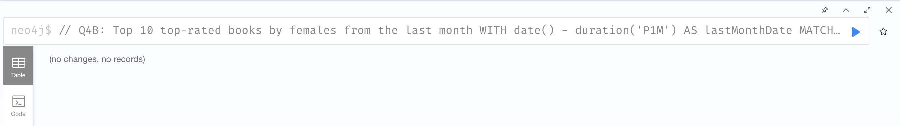

```cypher
// Q5: Top 10 trending books in the Fantasy genre from the last month
WITH date() - duration('P1M') AS lastMonthDate

MATCH (b:Book)-[:BELONGS_TO]->(g:Genre), (u:User)-[r:READ]->(b)
WHERE g.genreName = 'Fantasy' AND r.dateRead >= lastMonthDate
RETURN b.title, COUNT(r) AS readers
ORDER BY readers DESC
LIMIT 10;
```

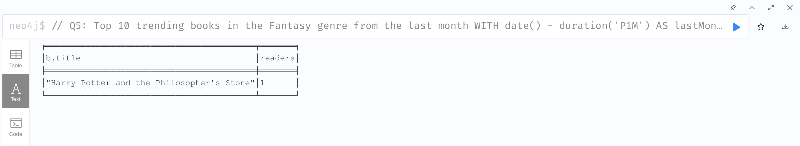

```cypher
// Q6: Top 10 top-rated books in the Fantasy genre from the last month
WITH date() - duration('P1M') AS lastMonthDate

MATCH (b:Book)-[:BELONGS_TO]->(g:Genre), (u:User)-[r:READ]->(b)
WHERE g.genreName = 'Fantasy' AND r.dateRead >= lastMonthDate
RETURN b.title, AVG(r.rating) AS avgRating
ORDER BY avgRating DESC
LIMIT 10;
```

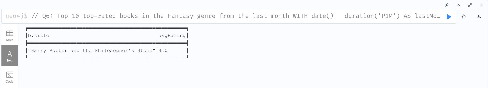

```cypher
// Q7: Top 10 trending books among millennials from the last month
WITH date() - duration('P1M') AS lastMonthDate

MATCH (u:User)-[r:READ]->(b:Book)
WHERE date(r.dateRead) >= lastMonthDate
  AND u.birthYear >= 1981 AND u.birthYear <= 1996

RETURN b.title, count(r) AS reads
ORDER BY reads DESC
LIMIT 10;
```

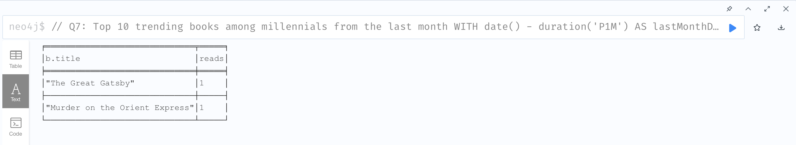

```cypher
// Q8: Top 10 top-rated books among millennials from the last month
WITH date() - duration('P1M') AS lastMonthDate

MATCH (u:User)-[r:READ]->(b:Book)
WHERE date(r.dateRead) >= lastMonthDate
  AND u.birthYear >= 1981 AND u.birthYear <= 1996

RETURN b.title, AVG(r.rating) AS avgRating
ORDER BY avgRating DESC
LIMIT 10;
```

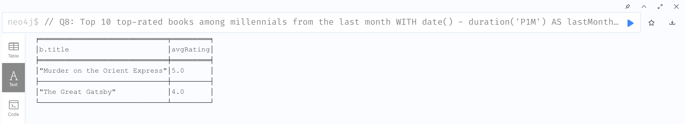

```cypher
// Q9: Top 10 trending books among a user's friends from the last month
WITH date() - duration('P1M') AS lastMonthDate

MATCH (u:User)-[:FRIENDS_WITH]->(f:User)-[r:READ]->(b:Book)
WHERE u.name = 'Sebastian' AND r.dateRead >= lastMonthDate
RETURN b.title, COUNT(f) AS friendsReads
ORDER BY friendsReads DESC
LIMIT 10;
```


```cypher
// Q10: Top 10 top-rated books among a user's friends from the last month
WITH date() - duration('P1M') AS lastMonthDate

MATCH (u:User)-[:FRIENDS_WITH]->(f:User)-[r:READ]->(b:Book)
WHERE u.name = 'Sebastian' AND r.dateRead >= lastMonthDate
RETURN b.title, AVG(r.rating) AS avgRating
ORDER BY avgRating DESC
LIMIT 10;
```

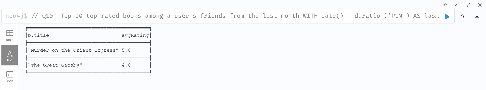

### General queries

Then we preview the nodes and relationships:

```cypher
// Show all nodes and relationships
MATCH (n) RETURN n;

// Show all constraints
SHOW ALL CONSTRAINTS;

// Delete all nodes and relationships
// MATCH (n) DETACH DELETE n;
```
